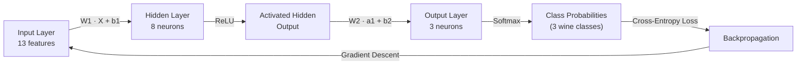

# 🧠 Neural Network from Scratch — Forward & Backpropagation in Pure NumPy

**No TensorFlow. No PyTorch. No `.fit()`.** Just linear algebra, calculus, and NumPy — a full neural network training pipeline built from first principles to prove the math is understood, not just imported.

<p align="left">
  
  
  
  
  
</p>

---

## 🎯 Why This Project Exists

Anyone can call `model.fit(X, y)`. Far fewer people can explain — and *implement* — what actually happens inside that call. This project builds a two-layer neural network entirely from scratch: manual weight initialization, manual forward propagation, manual gradient derivation via the chain rule, and manual gradient descent updates.

It's a deliberate step back from high-level frameworks to demonstrate a working, first-principles understanding of:

- How data flows forward through weighted layers and non-linear activations
- How error flows *backward* through the network via the chain rule
- How gradients translate into parameter updates that actually reduce loss

This is the kind of foundational depth that separates "I use deep learning libraries" from "I understand deep learning."

---

## 🏗️ Network Architecture

A single-hidden-layer feedforward network trained on the UCI Wine dataset (multi-class classification):



| Layer | Neurons | Activation |
|---|---|---|
| Input | 13 (wine chemical features) | — |
| Hidden | 8 | ReLU |
| Output | 3 (wine classes) | Softmax |

---

## 📊 Results

The network was trained for 100 epochs using batch gradient descent (`lr = 0.05`) on a stratified 80/20 train-test split (142 train / 36 test samples).

| Metric | Train | Test |
|---|---|---|
| **Accuracy** | 93.66% | **91.67%** |
| **Cross-Entropy Loss** | 0.1972 | 0.2449 |

**Loss trajectory across training:**

| Epoch | Loss |
|---|---|
| 0 | 5.2334 |
| 20 | 0.6801 |
| 40 | 0.4437 |
| 60 | 0.3209 |
| 80 | 0.2448 |

The loss drops from **5.23 → 0.24** over 100 epochs, and a randomly-initialized network (38.7% baseline accuracy) is trained up to **91.67% test accuracy** — using nothing but hand-written NumPy operations.

---

## ⚙️ What's Implemented

- ✅ Custom activation functions — ReLU, Sigmoid, Tanh, and a **numerically stable Softmax** (max-subtraction trick to avoid overflow)
- ✅ Manual weight/bias initialization (`np.random.randn` for weights, zeros for biases)
- ✅ Forward propagation through hidden and output layers
- ✅ One-hot label encoding
- ✅ Categorical Cross-Entropy loss with epsilon-clipping for numerical stability
- ✅ Full backpropagation — output-layer gradients, ReLU derivative masking, hidden-layer gradients, all derived via the chain rule
- ✅ Gradient descent parameter updates
- ✅ End-to-end training loop (forward → loss → backward → update)
- ✅ Train/test evaluation with accuracy and loss reporting
- ✅ Visualization of predicted vs. actual classes before and after training

---

## 🔬 Core Math, Implemented by Hand

**Forward pass:**
```
z1 = X · W1 + b1        a1 = ReLU(z1)
z2 = a1 · W2 + b2        a2 = Softmax(z2)
```

**Loss:**
```
L = -Σ (y_true · log(y_pred))
```

**Backward pass (chain rule):**
```
dz2 = (a2 - y_true) / m
dW2 = a1ᵀ · dz2            db2 = Σ dz2
da1 = dz2 · W2ᵀ
dz1 = da1 * ReLU'(z1)
dW1 = Xᵀ · dz1              db1 = Σ dz1
```

**Update:**
```
W = W - learning_rate * dW
```

---

## 🧰 Tech Stack

| Purpose | Tool |
|---|---|
| Numerical computation | NumPy |
| Dataset & preprocessing | scikit-learn (`load_wine`, `StandardScaler`, `train_test_split`) |
| Visualization | Matplotlib |
| Environment | Jupyter Notebook |

---

## 📁 Repository Structure

```
├── Backpropagation.ipynb   # Full forward + backward propagation pipeline
└── README.md                # You are here
```

---

## ▶️ How to Run

```bash
git clone https://github.com/vishnusai2005/<repo-name>.git
cd <repo-name>
pip install numpy matplotlib scikit-learn jupyter
jupyter notebook Backpropagation.ipynb
```

---

## 🧭 Honest Limitations & Next Steps

In the interest of transparency (rather than overselling the result):

- **Single hidden layer, batch gradient descent** — no mini-batching, momentum, or adaptive optimizers (Adam/RMSprop) yet.
- **No regularization** — no L2 weight decay or dropout, so the model is more prone to overfitting on larger/noisier datasets than the small (178-sample) Wine dataset.
- **Fixed architecture** — hidden layer size (8) and learning rate (0.05) were chosen manually, not tuned via cross-validation or hyperparameter search.
- **ReLU dead-neuron risk** — no leaky-ReLU/He-initialization safeguards, which can matter on deeper networks.

**Planned extensions:**
- Add L2 regularization and mini-batch/stochastic gradient descent
- Extend to a configurable multi-layer (deep) architecture
- Add Adam optimizer implemented from scratch
- Benchmark against an equivalent `sklearn.MLPClassifier` / PyTorch model

---

## 👤 About Me

I'm **Vishnusai Vydhyam**, a final-year B.Tech CSE (AI & ML) student building toward a career in Machine Learning and AI Engineering. This project is part of a self-driven deep learning fundamentals track — moving from perceptrons, to forward propagation, to full backpropagation from scratch — before advancing to modern architectures and transformer-based models.

- 💻 GitHub: [vishnusai2005](https://github.com/vishnusai2005)
- 🔗 LinkedIn: [vishnusai-vydhyam](https://linkedin.com/in/vishnusai-vydhyam/)
- 🤗 Hugging Face: [v2005](https://huggingface.co/v2005)
- 🐦 X: [@VishnusaiSaii](https://x.com/VishnusaiSaii)

If you're a recruiter or hiring manager reviewing this — I'm actively seeking **ML / Data Science / AI Engineer** internship and full-time roles. Feel free to reach out via LinkedIn.

---

## 📜 License

This project is open-sourced under the MIT License — feel free to learn from it, fork it, and build on it.
